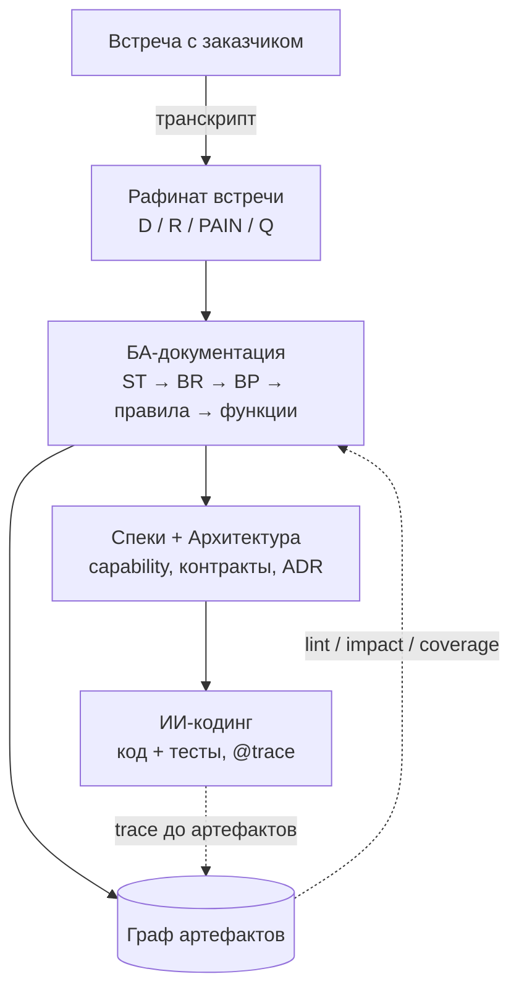

# Полный цикл

Сквозная цепочка от слов заказчика до работающего кода. Карта: что за чем идёт, что производит каждая стадия, чем удержан ИИ. Как делать каждую стадию — в [02_Процесс](../02_Процесс/).

## Цепочка целиком



Стрелка вниз — поток создания. Пунктир — обратная проверка: граф ловит расхождения, код трассируется обратно к артефактам.

## Стадии

|Стадия|Производит|Семья фреймворка|Инструмент|Как делать|
|---|---|---|---|---|
|**1. Встреча → требования**|рафинат встречи с маркерами `[D]/[R]/[PAIN]/[Q]`|документная|skill `ba-refine-meeting`|[01_Требования_и_встречи](../02_Процесс/01_Требования_и_встречи.md)|
|**2. БА-документация**|артефакты бизнес-знания: `ST`, `BR`, `BP`, `BR-XX`, `BD`, `DM`, `BF`|документная|skills `ba-generate-*` + граф-инструмент|[02_БА_документация](../02_Процесс/02_БА_документация.md)|
|**3. Спеки + архитектура**|поведение (capability/`F`), контракты, ADR|документная|OpenSpec **или** арх-фреймворк (альтернативы)|[03_Спеки_и_архитектура](../02_Процесс/03_Спеки_и_архитектура.md)|
|**4. ИИ-кодинг**|работающий код + тесты|кодовая (рантайм)|код-фреймворк|[04_ИИ_кодинг](../02_Процесс/04_ИИ_кодинг.md)|

## Порядок внутри БА и спек

Частый вопрос — что раньше. Жёсткий конвейер только внутри БА (каждый шаг потребляет предыдущий):

```
рафинат → стейкхолдеры (ST) → требования (BR.X) → процессы (BP)
        → правила (BR-XX) → функции (BF, индекс)
```

Параллельно по ходу: решения `BD` (фиксируются, когда на встрече сделан выбор), доменная модель `DM/EN/SM`, модули `M`. **Спеки и архитектура — после БА**, не до: они цитируют решения и правила БА как источник истины, а не код или догадку. Но внутри стадии это **не** «сначала спека, потом архитектура»: OpenSpec и архитектурный фреймворк пересекаются и обычно берутся как альтернативы под тип проекта (когда что → [03_Спеки_и_архитектура](../02_Процесс/03_Спеки_и_архитектура.md)). Код — последним; он прототип, не источник правды.

## Трассировка насквозь

Один факт проходит всю цепь и нигде не дублируется:

```
встреча: «скидка лояльности — 15%»
  → BD-02 (решение, кто и когда принял)
  → BR-10 (правило: применение скидки при выполнении условия)
  → F-04 / capability (спека: Requirement + Scenario)
  → код: // @trace: BR-10  (проверка в реализации)
```

Поменялось решение — запрос `impact BD-02` к графу покажет всю цепочку вниз: какие правила, спеки и участки кода протухли. Это и есть смысл связки фреймворк + граф на полном цикле.

## Кто это ведёт

Всю цепь ведёт один [фулл-стек ИИ-специалист](01_Зачем_ИИ_в_ИТ_проекте.md): на каждой стадии он берёт нужный фреймворк, держит ИИ в рамках и проверяет результат. Документные фреймворки (стадии 1–3) переиспользует, код-фреймворк (стадия 4) при необходимости [строит сам](../03_Фреймворки/06_Код_фреймворк.md).
